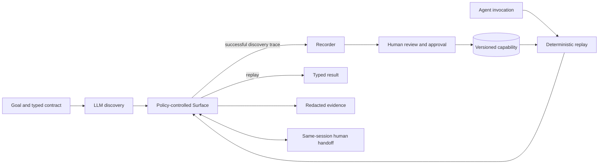

# Understudy: design write-up

## 1. Architecture

Understudy has two execution paths. Discovery uses a model to complete a natural-language goal and records the successful flow. Replay executes the approved artifact with typed inputs and no model decisions.



Discovery and replay share policy, the `Surface` UI abstraction, evidence/redaction, and handoff. Only discovery can access a model. The implementation uses Playwright against a local hostile banking UI with frames, nested tables, volatile IDs, tenant-specific labels, and controlled failures.

The separation is intentional: the model explores, while production execution stays reviewable, predictable, and inexpensive.

## 2. Artifact schema

The artifact is a capability contract, not a raw transcript. It contains:

- stable identity, schema version, revision, application, and surface type;
- typed inputs and outputs with validation and sensitivity flags;
- ordered actions with accessible target descriptions and reviewed fallbacks;
- checkpoints, known business outcomes, and bounded recovery rules;
- risk, approval, tenant overlays, discovery provenance, and a contract hash.

Only values declared as inputs before discovery become parameters. This avoids guessing from similar-looking text. The recorder also replaces volatile output descriptions with relationships. For example, it reads the Balance cell in the row containing SAVINGS instead of locating a member-specific currency value.

New artifacts are drafts. Approval binds the reviewed executable contract to a hash; changed or unapproved irreversible artifacts fail closed.

## 3. Determinism & error handling

Replay validates inputs and tenant configuration, then follows the saved step order. Target resolution uses a fixed ladder: relational table description, exact accessible role/name, scoped role/name, then an explicitly saved fallback. It polls only within a time budget and checks the resulting state after each transition.

The result contract separates four cases:

- `ok`: checkpoints pass and declared outputs are returned;
- `outcome`: a valid business result such as member not found or permission denied;
- `failed`: input, policy, target, application, timeout, or checkpoint failure with step-level evidence;
- `escalated`: a person owns a live intervention.

Recovery is artifact-declared and attempt-limited, such as dismissing a known interstitial or waiting for a late control. Replay never asks a model to improvise.

## 4. Heterogeneity & multi-tenant

Discovery and replay depend on `Surface`, not Playwright directly. A desktop adapter could implement the same observe, resolve, and act operations through an accessibility API without changing the artifact or executor.

One base artifact can have small reviewed tenant overlays for entry URLs or visible labels. The same capability runs for Riverbend and Summitline even though `Member ID` becomes `Member Number`. Checkpoint failures and repeated use of weaker locator fallbacks are drift signals scoped by product, tenant, and version. A reviewed label or route difference becomes an overlay; a materially different workflow requires a new artifact revision rather than a growing tenant patch.

The submission proves the abstraction locally. It does not build distributed multi-tenant infrastructure.

## 5. Escalation & handoff

An intervention carries the run, capability, step, reason, location, and current evidence. Automation releases its ownership lease, and a named operator claims the same live browser session. While the operator owns it, automation actions throw.

Human actions are audited without raw typed values. After release, replay verifies the expected checkpoint before continuing. The tested state flow is:

```text
automation -> awaiting human -> claimed -> released -> verified resume
                             \-> abandoned -> automation stops or retries by policy
```

The local implementation proves pause, exclusive ownership, same-session control, action capture, and verified resume. Production would add authenticated identity, durable leases, remote-session streaming, and worker recovery.

## 6. Safety

The runtime, not the model, controls execution. Exact-host/path allowlists and browser interception block disallowed navigation, frames, redirects, and popups. The action vocabulary is limited, risky steps are gated, and inputs are validated before browser work.

Sensitive values are registered with the redactor before evidence is written. Artifacts and logs exclude credentials, raw PII, raw HTML, full model transcripts, and operator-entered text. The target contains fabricated records only.

Known gaps for real financial use are screenshot redaction, encryption, access control, retention rules, and authenticated operators.

## 7. Cuts

The project keeps one complete local vertical slice. The operator UI is minimal, there is no hosted deployment, and desktop or production multi-tenant infrastructure is represented only by clean seams. These cuts preserve focus on the artifact, deterministic replay, error handling, safety, evidence, and same-session handoff.

Two bounded stretch goals remain: approved artifacts are exposed as typed agent-callable tools, and one artifact is reused across two tenant variants. Next work would harden operator identity and durable session ownership before adding broader surface support.
